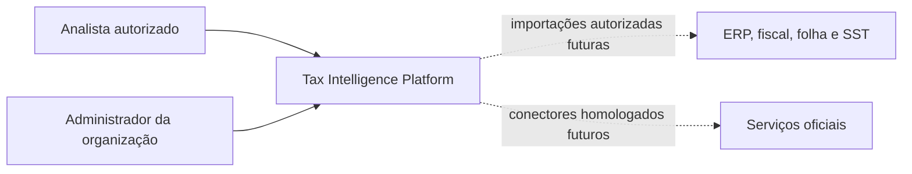
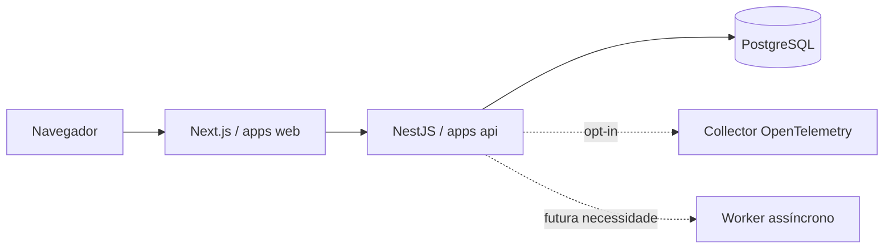
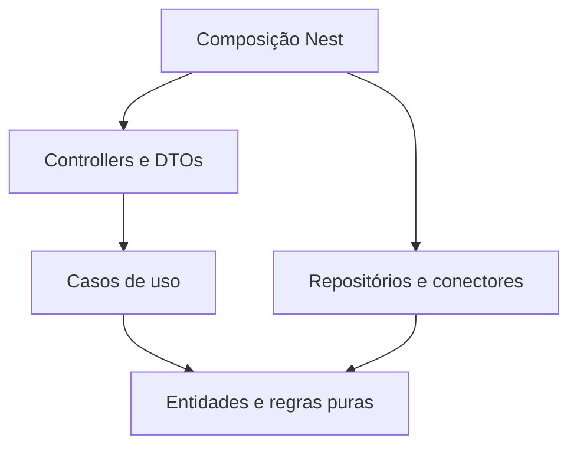

# Arquitetura da fundação

**Decisão técnica desta etapa:** monorepo pnpm/Turborepo e monólito modular NestJS, com Next.js como aplicação web independente. A API e o frontend são dois processos, sem decomposição dos domínios em microsserviços. [ADR 0001](../adr/0001-modular-monolith.md).

## C4: contexto

## C4: containers planejados

## Componentes e dependências

Domain não importa Nest, ORM, React ou transporte. Application define portas quando houver uma fronteira real; não criar interfaces apenas para espelhar classes. Infrastructure implementa persistência e serviços externos. Presentation traduz contrato em comando e erro de domínio em resposta. Módulos são compostos na API; um contexto não importa arquivos internos de outro.

`apps/web` usa `ui` e `contracts`; `apps/api` usa `contracts` e `database`; `database` não conhece controllers; `contracts` contém DTOs operacionais e schemas de transporte, sem entidades persistidas; `config` compartilha configurações, não regras. Referências entre pacotes sempre pelo nome público. Aplicar restrições de importação no bootstrap e estendê-las a contextos quando criados.

## Estado concreto

Consulta administrativa paginada de membros implementada no [ADR 0013](../adr/0013-administrative-membership-directory.md), com UUID/papel/estado e autorização no mesmo snapshot da leitura. [Validação](../engineering/administrative-membership-directory-validation.md). Complementa a API administrativa; a administração BFF/UI continua pendente.

Endpoints operacionais, tela de disponibilidade, verificação de access tokens, login/sessões BFF, consulta de memberships, seleção no navegador e revogação administrativa na API estão implementados com testes. A API compõe módulos públicos de autenticação e organizações; serviços usam portas independentes de Nest/ORM. Revogação revalida administrador ativo na transação, preserva o último administrador e grava evento atômico com locks. BFF acessa somente sessões técnicas e consulta memberships pela API; seleção não persiste autorização. Alteração de papéis existentes também está implementada, conforme [ADR 0011](../adr/0011-membership-role-changes.md), com [evidências](../engineering/membership-role-validation.md). Concessão a atores existentes está implementada no [ADR 0012](../adr/0012-membership-grants.md), sem reativação ou bootstrap de administrador. Administração BFF/UI, importação, diagnóstico, permissões fiscais e RLS seguem pendentes. [Evidências técnicas](../engineering/bootstrap-validation.md), [sessões BFF](../engineering/bff-session-validation.md), [memberships](../engineering/membership-validation.md), [seleção no navegador](../engineering/browser-organization-validation.md), [revogação](../engineering/membership-revocation-validation.md), [mapa de contextos](../domains/context-map.md), [contratos](api.md), [persistência](persistence.md), [evolução](evolution.md).
