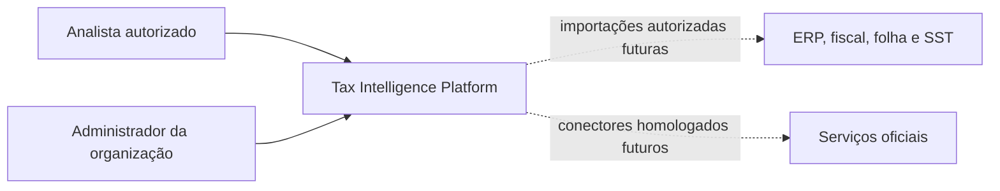
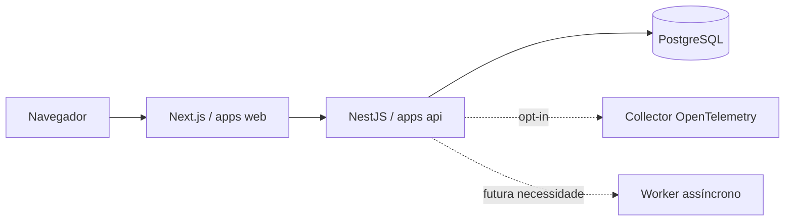
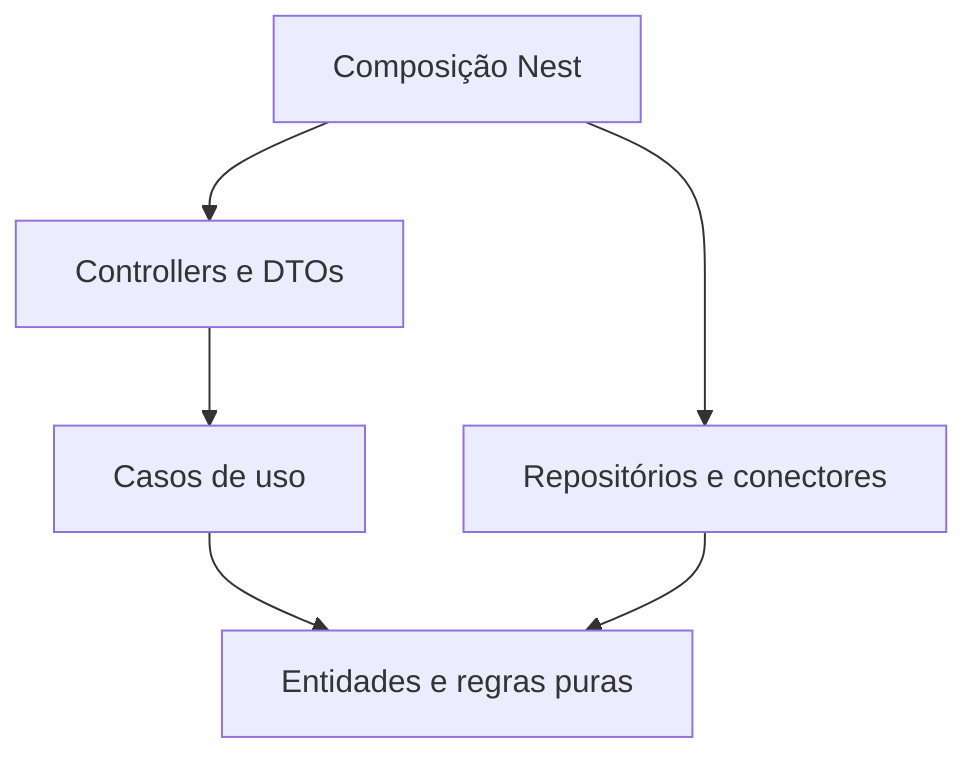

# Arquitetura da fundação

**Decisão técnica desta etapa:** monorepo pnpm/Turborepo e monólito modular NestJS, com Next.js como aplicação web independente. A API e o frontend são dois processos, sem decomposição dos domínios em microsserviços. [ADR 0001](../adr/0001-modular-monolith.md).

## C4: contexto

## C4: containers planejados

## Componentes e dependências

Domain não importa Nest, ORM, React ou transporte. Application define portas quando houver uma fronteira real; não criar interfaces apenas para espelhar classes. Infrastructure implementa persistência e serviços externos. Presentation traduz contrato em comando e erro de domínio em resposta. Módulos são compostos na API; um contexto não importa arquivos internos de outro.

`apps/web` usa `ui` e `contracts`; `apps/api` usa `contracts` e `database`; `database` não conhece controllers; `contracts` contém DTOs operacionais e schemas de transporte, sem entidades persistidas; `config` compartilha configurações, não regras. Referências entre pacotes sempre pelo nome público. Aplicar restrições de importação no bootstrap e estendê-las a contextos quando criados.

## Estado concreto

Endpoints operacionais, tela de disponibilidade, verificação de access tokens, login/sessões BFF e consulta autenticada de memberships estão implementados com testes. A API compõe os módulos públicos de autenticação e organizações; o serviço de organizações usa portas independentes de Nest/ORM. Importação, diagnóstico, administração/auditoria de memberships, permissões de negócio e RLS seguem pendentes. [Evidências técnicas](../engineering/bootstrap-validation.md), [identidade](../adr/0006-development-identity-provider.md), [sessões BFF](../engineering/bff-session-validation.md), [memberships](../engineering/membership-validation.md), [mapa de contextos](../domains/context-map.md), [contratos](api.md), [persistência](persistence.md), [evolução](evolution.md).
