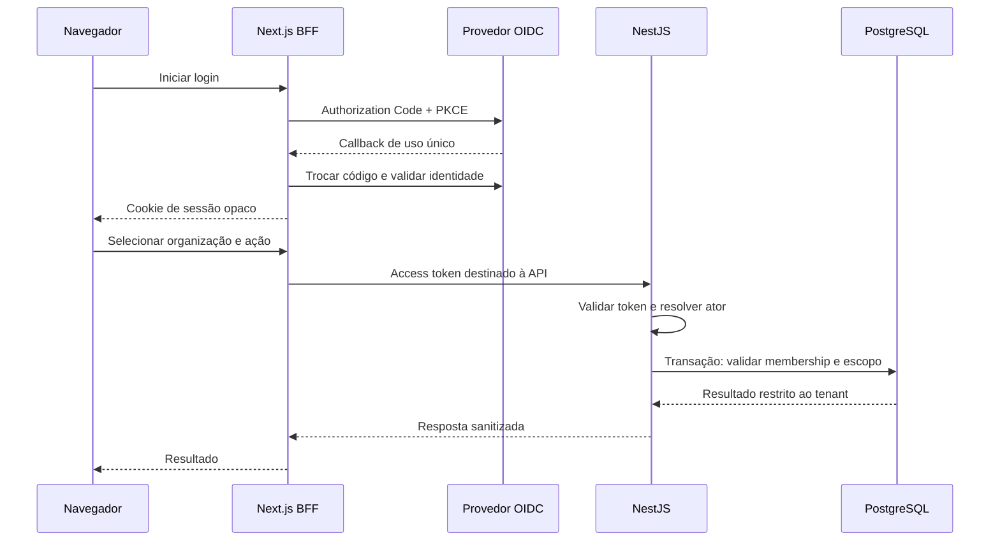

# RFC 0001 — Identidade, membership e isolamento

BFF administrativo implementado conforme [ADR 0014](../adr/0014-administrative-membership-bff.md), com token server-side, Origin/CSRF e autorização revalidada pela API. Não concede acesso SQL de domínio ao web nem implementa UI administrativa. [Validação](../engineering/administrative-membership-bff-validation.md).

Status: proposta de referência com implementação parcial por etapas. Autenticação, sessões BFF, consulta/seleção e revogação administrativa de memberships estão implementadas nos ADRs 0006–0010. Revogação tem auditoria transacional, locks e preserva o último administrador; mudança de papéis existentes está implementada no [ADR 0011](../adr/0011-membership-role-changes.md), sob o mesmo lock. Concessão a atores existentes está implementada no [ADR 0012](../adr/0012-membership-grants.md), sem reativação. UI administrativa, permissões fiscais, RLS e jornada completa permanecem pendentes. Responsável pela decisão e revisão de segurança: mantenedor do projeto.

Atualização posterior ao PR #8: [ADR 0008](../adr/0008-membership-directory.md) delimita a consulta de vínculos ativos com role de leitura. A próxima leitura após revogação confirmada nega acesso; uma leitura em andamento pode concluir pelo snapshot. O [ADR 0010](../adr/0010-membership-revocation.md) implementa locks para revogação administrativa; sua adoção em outras operações com efeitos permanece proposta. Não interpretar autenticação e lookup de membership como conclusão da vertical.

## Problema e aceite

Consulta administrativa paginada de membros implementada no [ADR 0013](../adr/0013-administrative-membership-directory.md): apenas administrador ativo, autorização e página na mesma instrução SQL, resposta mínima sem identidade externa. Não amplia acesso SQL da web nem implementa UI administrativa/RLS. [Evidências](../engineering/administrative-membership-directory-validation.md).

A fundação original possuía somente endpoints operacionais; os controles implementados posteriormente estão identificados no status acima. A primeira vertical precisa identificar o ator, verificar sua associação e impedir acesso a dados de outra organização. Login bem-sucedido não demonstra autorização nem isolamento.

Aceite do desenho: identidade estável, fronteira de sessão explícita, autorização por ação, revogação definida e testes negativos reproduzíveis. A implementação depende de escolha do provedor, aceite desta proposta e autorização específica da etapa. Ver [threat model](../security/identity-tenancy-threat-model.md) e [matriz de testes](../engineering/identity-tenancy-test-plan.md).

## Fluxo proposto

Proposta: BFF no Next.js, sessão server-side e cookie HttpOnly/Secure/SameSite=Lax em produção. Tokens não ficam em localStorage nem em payloads para o navegador. PKCE S256, state e nonce vinculados a uma tentativa, redirect URI exata e destino pós-login restrito a caminhos locais. Rejeitar callback reutilizado. Proteger mutações por validação de origem e token CSRF; CORS não substitui isso. [OIDC Core](https://openid.net/specs/openid-connect-core-1_0.html#CodeFlowAuth) e [orientação OWASP](https://cheatsheetseries.owasp.org/cheatsheets/OAuth2_Cheat_Sheet.html).

O ID token serve ao login do BFF; não é credencial de acesso à API. A API verifica access token com issuer e audience configurados, assinatura, algoritmo permitido e validade temporal. Provedor deve documentar o formato do access token e revogação: JWT exige JWKS confiável; token opaco exige introspecção autenticada. Configuração de issuer/JWKS não vem de headers do usuário; falhas de verificação não liberam acesso. Algoritmos, skew, TTL da sessão e estratégia de refresh serão registrados com o provedor antes do código.

Sessão opaca persistida server-side com expiração e revogação; armazenamento e proteção de tokens ainda precisam de decisão. Logout local invalida a sessão e remove o cookie. Logout no provedor é complemento, não garantia de revogação imediata de access tokens. Revogação local de membership deve bloquear a próxima operação autorizada; revogação no IdP precisa de SLA e mecanismo escolhidos, sem promessa antecipada.

## Identidade e associação

Identity and Access resolve identidade externa pela dupla `(issuer, subject)` e liga a um actor interno. Email ou nome não são chave de identidade nem autorização. Organizations and Tenancy possui Organization e Membership; outros contextos possuem suas próprias tabelas tenant-owned. Não há associação automática por domínio de email ou claims arbitrárias.

Organization selecionada é intenção não confiável. Cada caso de uso valida membership ativa e permissão server-side. Roles propostas: organization_admin administra associações; analyst importa; reviewer registra parecer; viewer consulta. Nenhum papel acessa tenant diferente por privilégio implícito. Grants/revokes e alterações de role exigem permissão administrativa, escopo e evento de auditoria na mesma transação. Provisionamento inicial deve ser uma operação controlada para ambiente sintético, nunca endpoint público de autoelevação.

Revogação concorrente: operação obtém lock compartilhado na membership validada e mantém até o commit; revogação precisa de lock incompatível. Assim, operação já autorizada pode concluir antes da revogação, e operações após o commit da revogação falham. Timeout/deadlock abortam sem efeito parcial. Membership não é mantida em cache de autorização nesta primeira entrega.

## Persistência e defesa adicional

Proposta do [ADR 0003](../adr/0003-tenant-isolation.md): escopo explícito em queries, FKs compostas por tenant e RLS com USING/WITH CHECK. Role runtime distinta de migration, sem superuser/BYPASSRLS e sem ownership das tabelas; considerar FORCE ROW LEVEL SECURITY. PostgreSQL permite bypass por superuser e papéis privilegiados; habilitar RLS sozinho não demonstra proteção. [Documentação PostgreSQL 17](https://www.postgresql.org/docs/17/ddl-rowsecurity.html).

Contexto de tenant é aplicado por transação após autorização, via configuração local parametrizada, e não por SET persistente na conexão. Ausência de contexto deve negar acesso. Leitura e escrita de domínio, mais auditoria correspondente, usam a mesma conexão/transação. Testar reutilização de pool depois de commit, rollback e erro. RLS não torna um runtime com SQL arbitrário confiável; queries parametrizadas e ausência de injeção continuam obrigatórias.

Lookup inicial de membership precede o contexto tenant-owned: repositório dedicado filtra ator verificado e organização selecionada, com privilégios mínimos e testes de não enumeração. Política exata das tabelas de controle e role de provisionamento deve ser especificada na migration futura; nenhum endpoint recebe consulta genérica dessas tabelas.

## Alternativas e pendências

| Opção                       | Benefício                                     | Custo/limite                                           |
| --------------------------- | --------------------------------------------- | ------------------------------------------------------ |
| BFF + OIDC externo          | Centraliza sessão e evita tokens no navegador | Requer sessão, refresh e CSRF seguros                  |
| SPA com tokens no navegador | Menos lógica no servidor web                  | Amplia tratamento de tokens e risco de exfiltração     |
| Autenticação própria        | Controle de credenciais                       | Password recovery, MFA e operação fora do foco inicial |

Preferência proposta: BFF com OIDC externo; fornecedor não escolhido. Avaliar federação B2B, MFA, audience própria da API, ambiente sintético, rotação, revogação, custo e operação. Não instalar fornecedor ou contratar serviço nesta etapa. Piloto e produção precisam de HTTPS e responsáveis operacionais.

Migração futura: schema técnico de identidade/membership antes de dados tenant-owned; sem backfill de dados reais. Rollback de funcionalidade desabilita novas rotas e sessões; não apagar auditoria ou derrubar constraints para contornar falhas. Restrições e semântica de revogação exigem revisão humana. Nenhuma migration é criada por esta RFC.
